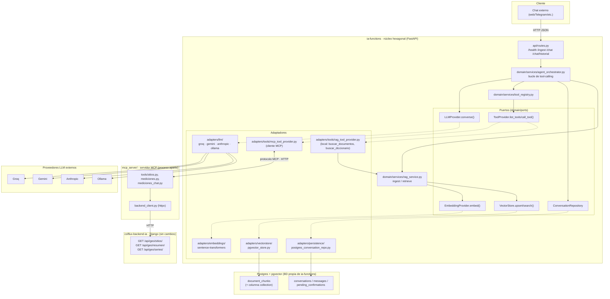

# Arquitectura

Rediseño de `ia-functions` como agente con RAG + tool-calling, en arquitectura
hexagonal (dominio puro + puertos + adaptadores), con conexión a datos del
backend Django vía un servidor MCP propio.

## Estado de revisión (punto por punto)

- [x] **Funcionalidad 1 — RAG documental**: confirmada, con fragmentación
  tipo compañero (párrafos completos, corte por frases, solapamiento por
  cola de frases) en vez del corte por conteo fijo de palabras. Embeddings
  se mantienen locales (sentence-transformers), con el modelo multilingüe
  `multilingual-e5-base` — ver `specs/embeddings-espanol.md`.
- [x] **Funcionalidad 2 — Colección "diccionario de campo"**: confirmada.
  Una sola tabla (`document_chunks`) con columna `collection`
  (`documents`/`dictionary`), en vez de las dos tablas separadas
  (`FragmentoConocimiento`/`TerminoCampo`) que usó el compañero.
- [x] **Funcionalidad 3 — Tool-calling multi-proveedor**: confirmada. Un
  formato neutro (`Message`/`ToolSpec`/`ToolCall`/`ModelReply`) vive en
  `domain/models.py`; cada adaptador (`groq`, `ollama`, `gemini`,
  `anthropic`) solo traduce a/desde ese formato. Cambiar de proveedor sigue
  siendo una variable de entorno (`LLM_PROVIDER`) — ni el orquestador ni las
  tools cambian según cuál esté prendido.
- [x] **Funcionalidad 4 — Orquestador**: confirmada. No existe hoy como
  pieza reutilizable en ninguno de los dos repos (tu `ia-functions` solo
  tiene el pipeline lineal de RAG); se construye aquí por primera vez,
  inspirado en el `responder()` del compañero pero reescrito sin sus bugs.
- [x] **Funcionalidad 5 — Registro de servidores MCP**: confirmada. El core
  de `ia-functions` nunca llama APIs externas directamente: solo registra
  servidores MCP (`MCP_SERVERS`) y consume sus tools de forma genérica.
  Cada integración externa (hoy: el backend Django) vive en su propio
  servidor MCP (`mcp_server/`), desplegable en el mismo docker-compose.
  Agregar una API nueva a futuro = otro servidor MCP + una entrada en
  `MCP_SERVERS`, sin tocar el core.
- [ ] Funcionalidad 6 — Memoria de conversación
- [ ] Funcionalidad 7 — API
- [ ] Funcionalidad 8 — `docker-compose.yml`
- [x] **Funcionalidad 9 — Escritura de mediciones vía chat con trazabilidad**:
  confirmada. `proponer_guardar_medicion`/`confirmar_medicion` deben dejar
  registrado que el dato vino del chat (no del ETL formal), para
  calidad/procedencia. Depende de que el backend agregue el campo/endpoint
  correspondiente — la tool queda declarada y lista, pendiente de activarse.

## 1. Diagrama de componentes



### Estructura de carpetas

```
app/
  domain/                        # núcleo — sin dependencias de frameworks
    models.py                    # Message, ToolCall, ToolSpec, ModelReply,
                                  # Chunk, RetrievedChunk, PendingConfirmation
    ports/
      llm_provider.py            # LLMProvider.converse(messages, tools, system) -> ModelReply
      embedding_provider.py      # EmbeddingProvider.embed(texts) -> vectors
      vector_store.py            # VectorStore.upsert/search(collection, ...)
      tool_provider.py           # ToolProvider.list_tools() / call_tool(name, args)
      conversation_repository.py # historial, guardar turno, pendiente de confirmar
    services/
      rag_service.py             # ingest_document(), retrieve(question, collection)
      tool_registry.py           # agrega varios ToolProvider en uno solo
      agent_orchestrator.py      # el bucle de tool-calling
  adapters/
    llm/groq.py, gemini.py, anthropic.py, ollama.py
    embeddings/sentence_transformers.py
    vectorstore/pgvector_store.py
    tools/
      rag_tool_provider.py       # expone buscar_documentos/buscar_diccionario
                                  # como tools locales (usa rag_service)
      mcp_tool_provider.py       # cliente MCP real (SDK `mcp`), habla con
                                  # el servidor mcp_server/ por HTTP
    persistence/
      postgres_conversation_repo.py  # tablas conversations/messages/pending_confirmations
  api/
    routes.py, schemas.py        # /health, /ingest, /chat (extendido)
  bootstrap/
    container.py                 # composition root: arma qué adaptador usa cada puerto
  config.py                      # settings extendidos
  main.py

mcp_server/                      # módulo aparte — su propio proceso/servicio
  __init__.py
  __main__.py                    # arranca el servidor MCP (FastMCP, transporte HTTP)
  config.py                      # BACKEND_API_BASE_URL
  backend_client.py              # cliente httpx sobre la API del backend Django
  tools/
    sitios.py                    # listar_sitios -> GET /api/geo/sitios/
    mediciones.py                # consultar_promedio, consultar_ultima_medicion
                                  # -> GET /api/geo/resumen/ (y /series/ si hace falta detalle)
    mediciones_chat.py           # proponer_guardar_medicion, confirmar_medicion:
                                  # declaradas pero devuelven "requiere endpoint
                                  # en el backend (no implementado)" hasta que exista
```

Regla de dependencia: `domain/` no importa nada de `adapters/` ni de FastAPI;
los adaptadores implementan los puertos; `bootstrap/container.py` es el único
lugar que conoce todas las implementaciones concretas y las conecta según
`config.py`.

## 2. Funcionalidades

1. **RAG documental** (reubicación de lo existente en `app/rag/*` →
   `domain/services/rag_service.py` + `adapters/embeddings` +
   `adapters/vectorstore`), con un cambio: se reemplaza el `chunk_text()`
   actual (corte por conteo fijo de palabras, puede partir una oración a la
   mitad) por la fragmentación del compañero (`app/ia/fragmentacion.py`):
   agrupa párrafos completos hasta un tamaño objetivo, solo parte por frases
   (nunca a mitad de oración) si un párrafo es muy grande, y el solapamiento
   arrastra la cola de frases completas del fragmento anterior en vez de un
   corte arbitrario de caracteres. Se mantienen los embeddings locales
   (sentence-transformers), solo cambia cómo se arman los chunks.
2. **Colección "diccionario de campo"**: en vez de una tabla nueva por tipo de
   conocimiento, se generaliza `document_chunks` agregando una columna
   `collection TEXT NOT NULL DEFAULT 'documents'`. `ingest_document(source,
   text, collection=...)` y `retrieve(question, collection=...)` filtran por
   ella. Menos tablas, mismo mecanismo de búsqueda para todo conocimiento
   vectorizado.
3. **Tool-calling multi-proveedor**: se reemplaza `LLMProvider.generate(...)`
   por `LLMProvider.converse(messages, tools, system) -> ModelReply`. Es el
   mismo puerto (`domain/ports/llm_provider.py`) para los 4 proveedores; el
   `bootstrap/container.py` decide cuál adaptador concreto instanciar según
   `LLM_PROVIDER` (igual que hoy con `factory.py`), así que **prender uno u
   otro no cambia nada del orquestador ni de las tools** — el cambio de
   proveedor sigue siendo solo una variable de entorno.

   Para lograrlo, se define un **formato neutro** en `domain/models.py` que
   el orquestador es el único que conoce:
   - `Message{rol, texto, llamadas}` — mensajes de usuario/asistente/tool.
   - `ToolSpec{name, description, parameters}` — JSON Schema, mismo formato
     para las 4 declaraciones (documents/dictionary y las de MCP).
   - `ToolCall{id, nombre, argumentos}` y `ModelReply{texto, llamadas}` —
     lo que devuelve `converse()`, sin importar el proveedor.

   Cada adaptador (`adapters/llm/*.py`) solo traduce este formato neutro al
   suyo, sin lógica de negocio:
   - `groq.py` / `ollama.py`: formato OpenAI (`tools`, `tool_calls`) — son
     casi el mismo adaptador, comparten la función de traducción.
   - `gemini.py`: convierte `ToolSpec` a `types.FunctionDeclaration` con
     `types.Schema`, y `Message` a `types.Content`.
   - `anthropic.py`: usa el bloque `tools` nativo de su API y el
     `tool_use`/`tool_result` de sus mensajes.

   Si el proveedor/modelo activo no soporta tools, `converse()` se llama
   igual con `tools=[]` — el RAG puro sigue funcionando en los 4.
   Consecuencia directa: si `mcp-backend` está apagado, el `ToolRegistry`
   tiene menos tools, pero el mismo adaptador LLM sigue sirviendo sin
   cambios — el desacople es por capa (puerto), no por proveedor.
4. **Orquestador** (`agent_orchestrator.py`): **no existe hoy en ninguno de
   los dos repos como pieza reutilizable** — `ia-functions` solo tiene el
   pipeline lineal de RAG (`answer_question()`, una sola llamada al LLM, sin
   decidir herramientas); el único orquestador real es el `responder()` del
   compañero (`app/ia/asistente.py`), con los bugs ya identificados. Se
   construye aquí por primera vez, inspirado en su lógica pero reescrito
   limpio: bucle de máx. N vueltas, registra `herramientas_usadas`, deduplica
   fuentes, arma el system prompt, y expone **todas** las tools — locales y
   remotas — a través de un único `ToolRegistry`:
   - Locales (`rag_tool_provider.py`, en proceso): `buscar_documentos`,
     `buscar_diccionario`.
   - Remotas (`mcp_tool_provider.py` → `mcp_server/`, protocolo MCP real):
     `listar_sitios`, `consultar_promedio`, `consultar_ultima_medicion`
     (funcionales, sobre la API pública del backend) y
     `proponer_guardar_medicion`/`confirmar_medicion` (declaradas, responden
     "no disponible: falta endpoint en el backend").

   Si no hay ningún servidor MCP registrado (ver punto 5), el `ToolRegistry`
   simplemente omite las tools remotas sin romper el resto del agente.
5. **`mcp_server/` + registro de servidores MCP**: la idea central es que
   `ia-functions` (el core del agente) **nunca llama APIs externas
   directamente** — ni al backend, ni a ninguna futura. En vez de eso:
   - `mcp_tool_provider.py` (en `adapters/tools/`) lee una lista de
     servidores MCP configurados (`MCP_SERVERS` en `config.py`: nombre + URL
     de cada uno) y a cada uno le pide su `list_tools()` vía protocolo MCP.
     Todas las tools de todos los servidores registrados se agregan
     automáticamente al `ToolRegistry`, sin que el core sepa nada de HTTP,
     endpoints ni formatos de cada API.
   - Cada integración externa concreta vive en **su propio servidor MCP**,
     no en el core. Hoy solo hay uno: `mcp_server/` (módulo/servicio
     aparte en este mismo repo), con `backend_client.py` (cliente `httpx`)
     que llama a `GET /api/geo/sitios/`, `GET /api/geo/resumen/` y
     `GET /api/geo/series/` del backend Django ya desplegado.
   - **Consecuencia práctica**: conectar una API nueva en el futuro (otro
     backend, un servicio meteorológico, lo que sea) es escribir *otro*
     servidor MCP y agregar su URL a `MCP_SERVERS` — cero cambios en
     `agent_orchestrator.py`, `tool_registry.py` ni en los adaptadores LLM.
   - `mcp_server/` corre como servicio propio en `docker-compose.yml`
     (`mcp-backend`), en el mismo stack que `api` y `db`.
6. **Memoria de conversación**: tablas nuevas en la BD propia de
   `ia-functions` (`conversations`, `messages`, `pending_confirmations`),
   adaptador `postgres_conversation_repo.py` (SQL directo con psycopg, mismo
   estilo que `vectorstore.py`, sin ORM). El manejo de "confirmo" vive en el
   orquestador y consulta `pending_confirmations` de esta BD, no del backend.
7. **API**: `/chat` pasa a usar el orquestador (acepta `conversation_id`/
   `usuario`, sigue devolviendo `{answer, sources}` — compatible con el
   frontend actual — y agrega `herramientas` y `pendiente_de_confirmacion`).
   `/ingest` acepta `collection` opcional. Nuevo `GET /chat/historial`.
8. **`docker-compose.yml`**: nuevo servicio `mcp-backend` (puerto `MCP_PORT`,
   default 8002) con `BACKEND_API_BASE_URL` apuntando al backend Django (por
   defecto `http://host.docker.internal:8000`, configurable). El servicio
   `api` gana la env var `MCP_SERVERS=colflux-backend=http://mcp-backend:8000/mcp`
   (lista de `nombre=url`, para poder registrar más de un servidor MCP el
   día que haga falta sin cambiar código).
9. **Escritura de mediciones vía chat, con trazabilidad de calidad**
   (`proponer_guardar_medicion` / `confirmar_medicion`): el flujo completo
   ya definido (proponer → mostrar resumen → esperar "confirmo" →
   escribir) debe dejar registrado, en el dato mismo, que **su origen fue el
   chat y no el ETL formal** — para que cualquier análisis o reporte pueda
   distinguir calidad/procedencia del dato (igual que el compañero separó
   `MedicionRapidaChat` de `MuestraGEI`/`SubmuestraGEI`, en vez de
   mezclarlas). Esto **depende del backend**: necesita o bien reutilizar un
   modelo tipo `MedicionRapidaChat` con su propio flag de origen, o un campo
   `origen`/`fuente` en el modelo de mediciones existente. Como no se toca
   `colflux-backend-ia` en esta fase, la tool queda **declarada y lista**
   en `mcp_server/tools/mediciones_chat.py`, pero solo se activa (deja de
   responder "no disponible") cuando el backend exponga el endpoint de
   escritura correspondiente con ese campo de origen.

## Fuera de alcance real (no por diseño, sino por falta de endpoint en el backend)

- Variables ambientales (temperatura, humedad, etc.): el backend no tiene
  ningún endpoint de lectura para ellas hoy.
- Ningún cambio en `colflux-backend-ia` en esta fase — todo lo de esta fase
  consume su API pública tal como está hoy. La funcionalidad 9 (escritura
  con trazabilidad de origen) queda lista del lado de `ia-functions` pero
  bloqueada hasta que el backend agregue el endpoint/campo necesario.
